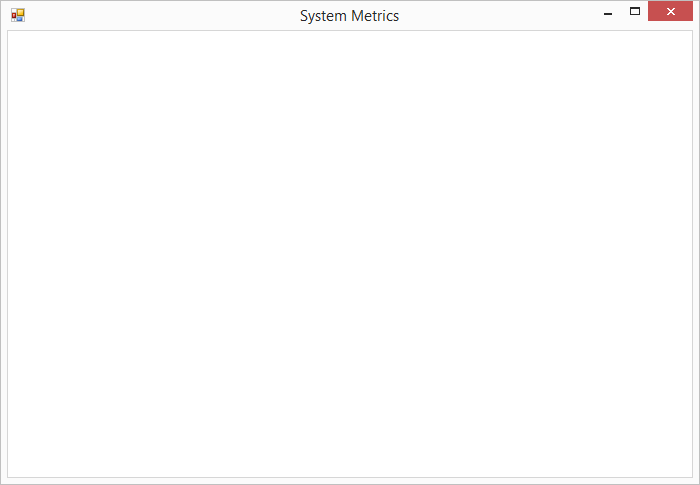
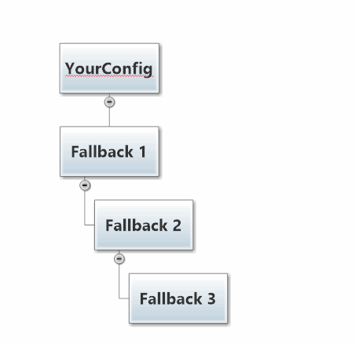
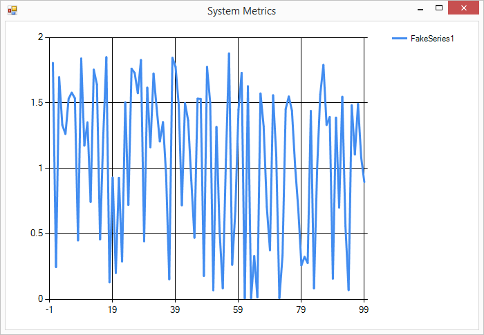

# Lesson 2.1: Using HOCON Configuration to Configure Akka.NET

If you try to build and run `SystemCharting.sln` in the [/DoThis/ folder](../DoThis/) for Unit 2 right away, you'll see the following output:



Huh? Well this isn't very exciting - aren't we supposed to be building a real-time data visualization application in Unit 2? What gives?

Oh wait, there's an exception in the **Debug** window. What does it say?

> [ERROR][2/24/2015 11-48-34 AM][Thread 0010][akka://ChartActors/user/charting] Cross-thread operation not valid: Control 'sysChart' accessed from a thread other than the thread it was created on.
Cause: System.InvalidOperationException: Cross-thread operation not valid: Control 'sysChart' accessed from a thread other than the thread it was created on.

Oh crap, you mean to say that the `ChartingActor` responsible for updating the [`System.Windows.Forms.DataVisualization.Charting.Chart`](https://msdn.microsoft.com/en-us/library/system.windows.forms.datavisualization.charting.chart.aspx) on this form isn't running on the UI thread? Does this mean we have to rewrite our actors to do something horrible?

No, we can relax. 

**We can solve this problem using [HOCON configuration in Akka.NET](http://getakka.net/wiki/Configuration) without updating any of our code.**

## Keys Concepts / Background

Akka.NET leverages a configuration format called [HOCON (Human-Optimized Config Object Notation)](http://getakka.net/wiki/HOCON) to allow developers to configure their Akka.NET applications, all the way down to an amazing level of detail.

> HOCON is an extensible configuration format that will allow you to configure everything from Akka.NET's ActorRefProvider implementation, logging, network transports, and more commonly - how individual actors are deployed.

### HOCON in Action

Here's an example of using HOCON with an `ActorSystem`, taken directly from the C# documentation for Akka.NET:

```csharp
var config = ConfigurationFactory.ParseString(@"
akka.remote.helios.tcp {
              transport-class = 
           ""Akka.Remote.Transport.Helios.HeliosTcpTransport, Akka.Remote""
              transport-protocol = tcp
              port = 8091
              hostname = ""127.0.0.1""
          }");

var system = ActorSystem.Create("Mysystem",config);
```

> In this case we're configuring a specific network transport for use with Akka.Remoting, a concept that goes well beyond what's covered in Unit 2. 

But as you can see, you can create a HOCON `Config` object from a simple `string` using the `ConfigurationFactory.ParseString` method - and once you have a `Config` object you can pass this to your `ActorSystem` inside the `ActorSystem.Create` method.

### HOCON from App.config and Web.config
Parsing HOCON from a `string` is handy for small configuration sections, but what if you want to be able to take advantage of [Configuration Transforms for App.config and Web.config](https://msdn.microsoft.com/en-us/library/dd465326.aspx) and all of the other nice tools we have in the `System.Configuration` namespace?

As it turns out, you can use HOCON inside these configuration files too! Here's an example, also taken from the Akka.NET docs:

````
<?xml version="1.0" encoding="utf-8" ?>
<configuration>
  <configSections>
    <section name="akka" 
             type="Akka.Configuration.Hocon.AkkaConfigurationSection, Akka" />
  </configSections>

  <akka>
    <hocon>
      <![CDATA[
          akka {
            log-config-on-start = off
            stdout-loglevel = INFO
            loglevel = ERROR
            actor {
              provider = "Akka.Remote.RemoteActorRefProvider, Akka.Remote"
              debug {
                  receive = on
                  autoreceive = on
                  lifecycle = on
                  event-stream = on
                  unhandled = on
              }
            }
            remote {
              helios.tcp {
                  transport-class = 
            "Akka.Remote.Transport.Helios.HeliosTcpTransport, Akka.Remote"
                  #applied-adapters = []
                  transport-protocol = tcp
                  port = 8091
                  hostname = "127.0.0.1"
              }
            log-remote-lifecycle-events = INFO
          }
      ]]>
    </hocon>
  </akka>
</configuration>
````

And then we can load this configuration section into our `ActorSystem` via the following code:

```csharp
var section = (AkkaConfigurationSection)ConfigurationManager.GetSection("akka");
var system = ActorSystem.Create("Mysystem", section.AkkaConfig);
```

> **NOTE:** [There's currently an open issue in Akka.NET](https://github.com/akkadotnet/akka.net/issues/671) to automatically take care of the `ConfigurationManager.GetSection("akka")` loading for you, so in the future you'll only need to write
> 
> ```csharp
> var system = ActorSystem.Create("Mysystem");
> ```
> 
> and your config section will be automatically loaded for you.

### HOCON Configuration Supports Fallbacks

Although this isn't a concept we leverage explicitly in Unit 2, it's a powerful trait of the `Config` class that comes in handy in lots of production use cases.

HOCON supports the concept of "fallback" configurations - it's easiest to explain this concept visually.



To create something that looks like the diagram above, we have to create a `Config` object that has three fallbacks chained behind it using syntax like this:

```csharp
var f0 = ConfigurationFactory.ParseString("a = bar");
var f1 = ConfigurationFactory.ParseString("b = biz");
var f2 = ConfigurationFactory.ParseString("c = baz");
var f3 = ConfigurationFactory.ParseString("a = foo");

var yourConfig = f0.WithFallback(f1)
				.WithFallback(f2)
				.WithFallback(f3);
```

If we request a value for a HOCON object with key "a", using the following code:

```csharp
var a = yourConfig.GetString("a");
```

Then the internal HOCON engine will match the first HOCON file that contains a definition for a key that matches path `a`, which is `f0` in this case - and the value "bar" will be returned.

> **Why didn't we return "foo" as the value for "a"?**  The reason is because HOCON only searches through fallback `Config` objects if a match isn't found earlier in the `Config` chain. If the top-level `Config` object has a match for `a`, that's what will be used every time.

Now what happens if we run the following code?

```csharp
var c = yourConfig.GetString("c");
```


In this case `yourConfig` will fallback twice to `f2` and return "baz" as the result.

### Dispatchers: The Thing We're Going to Configure!

Now that you have some background on Akka.NET Configuration, let's talk about the problem we're going to solve via configuration: changing the [`Dispatcher`](http://getakka.net/wiki/Dispatchers) for the `ChartingActor`.

What's a `Dispatcher`, you ask?

It's the piece of glue that pushes messages from your actor's mailbox into your actor instances themselves - and all actors who share a given `Dispatcher` also share that `Dispatcher`'s threads for parallel execution.

The default dispatcher in Akka.NET is the `ThreadPoolDispatcher`, and as you might have guessed - this dispatcher runs all of our actors on top of the CLR `ThreadPool`.

There are a variety of different dispatcher flavors available for us to use with our actors:

* `SingleThreadDispatcher` - runs multiple actors on a single thread;
* `ThreadPoolDispatcher` - runs actors on top of the CLR `ThreadPool` for maximum concurrency;
* `ForkJoinDispatcher` (**[not yet implemented](https://github.com/akkadotnet/akka.net/issues/675)**) - runs actors on top of a dedicated group of threads, for tunable concurrency; and
* `CurrentSynchronizationContextDispatcher` - this schedules all actor messages to be processed on the same synchronization context as the caller.

In this instance, we're going to use the `CurrentSynchronizationContextDispatcher` to ensure that the `ChartingActor` runs on the UI thread of our WinForms application. That way the `ChartingActor` can update any UI element it wants without having to do any cross-thread marshalling - the actor's `Dispatcher` can automatically take care of that for us!

#### Question: is it a bad idea to have actors run on the UI thread?

The short answer is "no" - as long as you don't perform any long-running operations, such as disk or network I/O, inside the actors who run on the UI thread then you'll be fine. In fact, *running actors on the UI thread is a smart thing to do for handling UI events and updates* as they eliminate all of the normal synchronization worries you'd otherwise have to do in a multi-threaded WPF or WinForms apps. 

> **Remember: [Akka.NET actors are lazy](http://petabridge.com/blog/akkadotnet-what-is-an-actor/)**. They don't do any work when they're not receiving messages.

## Exercise
We need to configure `ChartingActor` to use the `CurrentSynchronizationContextDispatcher` in order to make this example run.

### Phase 1 - Add Akka.NET Config Section to App.Config
The first thing you need to do is declare the `AkkaConfigurationSection` at the top of your App.config:

````
<!-- add this just below the openining `config` tag -->
<configSections>
    <section name="akka" type="Akka.Configuration.Hocon.AkkaConfigurationSection, Akka" />
</configSections>
````

Next, we need to add the content of the `AkkaConfigurationSection` to this document:

````
<!-- add this anywhere in app.config after the `configSections` element -->
<akka>
    <hocon>
      <![CDATA[
          akka {
            actor{
              deployment{
                #used to configure our ChartingActor
                /charting{
				  #causes ChartingActor to run on the UI thread for WinForms
                  dispatcher = akka.actor.synchronized-dispatcher 
                }
              }
            }
          }
      ]]>
    </hocon>
  </akka>
````

> **NOTE**: As you might have guessed, any line with `#` at the front of it is treated as a comment in HOCON. [Learn more about HOCON syntax here](http://getakka.net/wiki/HOCON).

`akka.actor.synchronized-dispatcher` is the shorthand name built into Akka.NET's default configuration for the `CurrentSynchronizationContextDispatcher`, so you don't need to use a fully-qualified type name or anything like that.

You might have also noticed that the configuration section that pertains to the `ChartingActor` was declared as `/charting` - **this is because actor deployment is done by the path and name of the actor, not the actor's type**.

Here's how we deploy the `ChartingActor` inside `Main.cs`:

```csharp
 _chartActor = Program.ChartActors.ActorOf(Props.Create(() => new ChartingActor(sysChart)), "charting");
```

When we call `ActorSystem.ActorOf` the `ActorOf` method will automatically look for any deployments declared in the `akka.actor.deployment` configuration section that correspond to the path of this actor - `/user/charting` in this case. 

> And because you, as the Akka.NET end-user, can only specify deployment settings for actors created inside the `/user/` hierarchy, you don't specify `/user` on your deployments - **it's implicit**.

### Phase 2 - Consume Your `AkkaConfigurationSection` Inside Your `ActorSystem`

[In the near future this step will be done automatically for you by Akka.NET](https://github.com/akkadotnet/akka.net/issues/671), but in the meantime we have to manually load your `AkkaConfigurationSection`.

Go to `Program.cs` and modify the `ActorSystem.Create` code to look like this:

```csharp
// program.cs - update all of the using statements
using System;
using System.Configuration;
using System.Windows.Forms;
using Akka.Actor;
using Akka.Configuration.Hocon;
```

And then load the `Config` into your `ActorSystem`:

```csharp
// program.cs - Main() method.
// replace the existing ActorSystem.Create call with this.
var section = (AkkaConfigurationSection)ConfigurationManager.GetSection("akka");
var config = section.AkkaConfig;
ChartActors = ActorSystem.Create("ChartActors", config);
```
And we're finished!

### Once you're done
Build and run `SystemCharting.sln` and you should see the following:



Compare your code to the code in the [/Completed/ folder](Completed/) to compare your final output to what the instructors produced.

## Great job!
Nice work on completing your first lesson in Unit 2! We covered a lot of concepts and hopefully you're going to walk away from this with an appreciation for just how powerful Akka.NET's configuration model truly is.

**Let's move onto [Lesson 2 - Using `ReceiveActor` for Smarter Message Handling](../lesson2).**